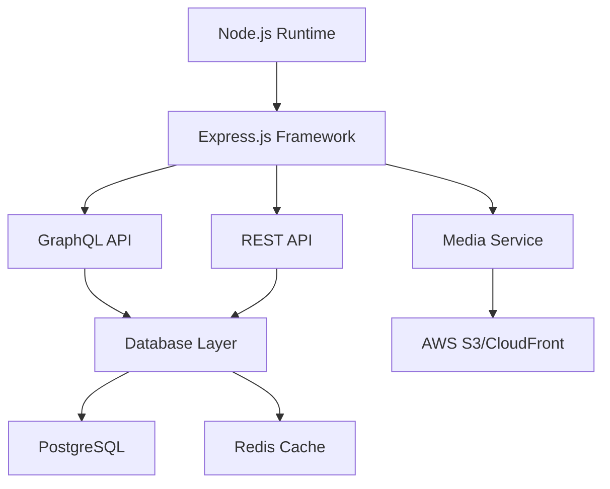

# Architecture Overview

LeadCMS is built on modern web technologies and follows industry best practices for scalability, performance, and developer experience. This document provides an in-depth look at the system architecture.

## System Architecture

<ImageGallery
  columns={1}
  images={[
    {
      src: "/docs/architecture-diagram.png",
      alt: "LeadCMS Architecture Diagram",
      caption: "High-level architecture showing the relationship between components"
    }
  ]}
/>

LeadCMS follows a **headless CMS architecture** that separates content management from content presentation, enabling maximum flexibility and performance.

## Core Components

### API Layer

The API layer serves as the central hub for all content operations:

```typescript
// Example API structure
interface APILayer {
  // Content Management
  content: {
    create: (data: ContentData) => Promise<Content>
    read: (id: string) => Promise<Content>
    update: (id: string, data: Partial<ContentData>) => Promise<Content>
    delete: (id: string) => Promise<void>
    list: (params: QueryParams) => Promise<Content[]>
  }

  // Media Management
  media: {
    upload: (file: File) => Promise<MediaAsset>
    transform: (id: string, params: TransformParams) => Promise<string>
    delete: (id: string) => Promise<void>
  }

  // User Management
  users: {
    authenticate: (credentials: Credentials) => Promise<AuthToken>
    authorize: (token: string, permission: string) => Promise<boolean>
  }
}
```

### Content Engine

The content engine handles all content-related operations:

<FeatureGrid columns={2}>
  <FeatureCard
    title="Content Types"
    description="Flexible schema definition with custom fields, validation rules, and relationships between content types."
  />
  <FeatureCard
    title="Versioning"
    description="Complete version history with rollback capabilities, draft states, and publishing workflows."
  />
  <FeatureCard
    title="Localization"
    description="Multi-language support with field-level translation management and locale-specific publishing."
  />
  <FeatureCard
    title="Relationships"
    description="Rich relationships between content items with one-to-one, one-to-many, and many-to-many support."
  />
</FeatureGrid>

### Media Pipeline

Advanced media processing and delivery:

<Steps>
  <Step title="Upload Processing">
    Files are uploaded to secure storage with automatic virus scanning and metadata extraction.
  </Step>
  <Step title="Transformation">
    Images are automatically optimized and transformed for different devices and use cases.
  </Step>
  <Step title="CDN Delivery">
    Media assets are delivered through a global CDN for optimal performance.
  </Step>
</Steps>

## Technical Stack

### Backend Technologies



**Core Technologies:**
- **Node.js 18+** - Runtime environment
- **TypeScript** - Type-safe development
- **Express.js** - Web application framework
- **GraphQL** - Flexible API queries
- **PostgreSQL** - Primary database
- **Redis** - Caching and sessions
- **AWS S3** - Media storage
- **CloudFront** - CDN delivery

### Database Design

LeadCMS uses a hybrid approach combining relational and document storage:

<Tabs items={[
  {
    label: "Schema",
    value: "schema",
    content: (
      <CodeBlock language="sql">
{`-- Content Types
CREATE TABLE content_types (
  id UUID PRIMARY KEY DEFAULT gen_random_uuid(),
  name VARCHAR(255) NOT NULL UNIQUE,
  schema JSONB NOT NULL,
  settings JSONB DEFAULT '{}',
  created_at TIMESTAMPTZ DEFAULT NOW(),
  updated_at TIMESTAMPTZ DEFAULT NOW()
);

-- Content Items
CREATE TABLE content_items (
  id UUID PRIMARY KEY DEFAULT gen_random_uuid(),
  content_type_id UUID REFERENCES content_types(id),
  slug VARCHAR(255),
  status VARCHAR(50) DEFAULT 'draft',
  data JSONB NOT NULL,
  metadata JSONB DEFAULT '{}',
  created_at TIMESTAMPTZ DEFAULT NOW(),
  updated_at TIMESTAMPTZ DEFAULT NOW(),
  published_at TIMESTAMPTZ
);

-- Indexes for performance
CREATE INDEX idx_content_items_type ON content_items(content_type_id);
CREATE INDEX idx_content_items_status ON content_items(status);
CREATE INDEX idx_content_items_slug ON content_items(slug);`}
      </CodeBlock>
    )
  },
  {
    label: "Relationships",
    value: "relationships",
    content: (
      <CodeBlock language="sql">
{`-- Content Relationships
CREATE TABLE content_relationships (
  id UUID PRIMARY KEY DEFAULT gen_random_uuid(),
  from_content_id UUID REFERENCES content_items(id) ON DELETE CASCADE,
  to_content_id UUID REFERENCES content_items(id) ON DELETE CASCADE,
  relationship_type VARCHAR(100) NOT NULL,
  metadata JSONB DEFAULT '{}',
  created_at TIMESTAMPTZ DEFAULT NOW()
);

-- Unique constraint to prevent duplicate relationships
CREATE UNIQUE INDEX idx_unique_relationships
ON content_relationships(from_content_id, to_content_id, relationship_type);`}
      </CodeBlock>
    )
  }
]} />

## Frontend Architecture

### Client Libraries

LeadCMS provides client libraries for popular frameworks:

<FeatureGrid columns={3}>
  <FeatureCard
    title="React/Next.js"
    description="Hooks, components, and utilities for React-based applications with SSR support."
  />
  <FeatureCard
    title="Vue.js"
    description="Composables and plugins for Vue 3 applications with Nuxt.js integration."
  />
  <FeatureCard
    title="Vanilla JS"
    description="Framework-agnostic JavaScript client for any web application."
  />
</FeatureGrid>

### Data Flow

```typescript
// Data flow example
interface DataFlow {
  // 1. Content Request
  request: ContentRequest

  // 2. API Processing
  processing: {
    validation: ValidationResult
    authorization: AuthResult
    caching: CacheResult
    database: DatabaseQuery
  }

  // 3. Response Delivery
  response: {
    content: ContentData
    metadata: ResponseMetadata
    caching: CacheHeaders
  }
}
```

## Security Architecture

### Authentication & Authorization

<Callout type="info" title="Security Layers">
LeadCMS implements multiple security layers:
- **JWT-based authentication** for stateless sessions
- **Role-based access control** for fine-grained permissions
- **API rate limiting** to prevent abuse
- **Content Security Policy** headers
- **OWASP compliance** for web application security
</Callout>

```typescript
// Permission system example
interface PermissionSystem {
  roles: {
    admin: Permission[]
    editor: Permission[]
    contributor: Permission[]
    viewer: Permission[]
  }

  permissions: {
    'content:read': boolean
    'content:write': boolean
    'content:delete': boolean
    'media:upload': boolean
    'users:manage': boolean
  }
}
```

### Data Protection

- **Encryption at rest** for sensitive data
- **TLS 1.3** for data in transit
- **Regular security audits** and penetration testing
- **GDPR compliance** with data portability and deletion
- **Backup encryption** with versioned storage

## Performance Optimization

### Caching Strategy

<Steps>
  <Step title="Application Cache">
    In-memory caching using Redis for frequently accessed content and computed results.
  </Step>
  <Step title="CDN Cache">
    Global edge caching through CloudFront for static assets and API responses.
  </Step>
  <Step title="Browser Cache">
    Optimized cache headers for client-side caching of static resources.
  </Step>
</Steps>

### Database Optimization

```sql
-- Query optimization examples
-- Materialized views for complex aggregations
CREATE MATERIALIZED VIEW popular_content AS
SELECT
  content_type_id,
  COUNT(*) as item_count,
  AVG(view_count) as avg_views
FROM content_items
WHERE status = 'published'
GROUP BY content_type_id;

-- Partial indexes for common queries
CREATE INDEX idx_published_content
ON content_items(created_at DESC)
WHERE status = 'published';
```

## Scalability

### Horizontal Scaling

LeadCMS is designed to scale horizontally:

- **Stateless API servers** for easy horizontal scaling
- **Database read replicas** for improved read performance
- **Message queues** for asynchronous processing
- **Microservices architecture** for independent scaling

### Load Balancing

```yaml
# Kubernetes deployment example
apiVersion: apps/v1
kind: Deployment
metadata:
  name: leadcms-api
spec:
  replicas: 3
  selector:
    matchLabels:
      app: leadcms-api
  template:
    spec:
      containers:
      - name: api
        image: leadcms/api:latest
        resources:
          requests:
            memory: "256Mi"
            cpu: "250m"
          limits:
            memory: "512Mi"
            cpu: "500m"
```

## Monitoring & Observability

### Application Monitoring

<FeatureGrid columns={2}>
  <FeatureCard
    title="Metrics Collection"
    description="Custom metrics for content operations, API performance, and user activity."
  />
  <FeatureCard
    title="Log Aggregation"
    description="Centralized logging with structured logs and real-time analysis."
  />
  <FeatureCard
    title="Error Tracking"
    description="Automatic error detection and notification with stack trace analysis."
  />
  <FeatureCard
    title="Performance Profiling"
    description="Application performance monitoring with bottleneck identification."
  />
</FeatureGrid>

### Health Checks

```typescript
// Health check implementation
interface HealthCheck {
  status: 'healthy' | 'unhealthy' | 'degraded'
  checks: {
    database: HealthStatus
    cache: HealthStatus
    storage: HealthStatus
    external_apis: HealthStatus
  }
  uptime: number
  version: string
}
```

## Development Workflow

### CI/CD Pipeline

<Steps>
  <Step title="Code Commit">
    Developers push code to Git repository with automated pre-commit hooks.
  </Step>
  <Step title="Automated Testing">
    Comprehensive test suite including unit, integration, and end-to-end tests.
  </Step>
  <Step title="Build & Deploy">
    Automated builds and deployments to staging and production environments.
  </Step>
  <Step title="Monitoring">
    Continuous monitoring and alerting for deployed applications.
  </Step>
</Steps>

## Integration Patterns

### Webhooks

```typescript
// Webhook configuration
interface WebhookConfig {
  events: WebhookEvent[]
  url: string
  secret: string
  active: boolean
  filters?: {
    content_types?: string[]
    operations?: ('create' | 'update' | 'delete')[]
  }
}

// Webhook payload example
interface WebhookPayload {
  event: string
  data: {
    content: ContentItem
    previous?: ContentItem
  }
  metadata: {
    timestamp: string
    signature: string
    delivery_id: string
  }
}
```

## Future Architecture

### Planned Enhancements

<Callout type="tip" title="Roadmap">
Upcoming architectural improvements:
- **Edge computing** integration for global content delivery
- **AI/ML pipeline** for content optimization and recommendations
- **Real-time collaboration** with operational transformation
- **Blockchain integration** for content authenticity verification
</Callout>

## Best Practices

When building with LeadCMS architecture:

1. **Use proper caching strategies** to minimize API calls
2. **Implement error handling** for network failures and API limits
3. **Follow security best practices** for API key management
4. **Monitor performance** and optimize based on real-world usage
5. **Design for scalability** from the beginning

## Next Steps

<FeatureGrid columns={2}>
  <FeatureCard
    title="API Reference"
    description="Detailed API documentation with examples"
    href="/docs/api-reference"
  />
  <FeatureCard
    title="Security Guide"
    description="Comprehensive security implementation guide"
    href="/docs/security"
  />
  <FeatureCard
    title="Performance Tuning"
    description="Advanced performance optimization techniques"
    href="/docs/performance"
  />
  <FeatureCard
    title="Scaling Guide"
    description="How to scale LeadCMS for high-traffic applications"
    href="/docs/scaling"
  />
</FeatureGrid>
