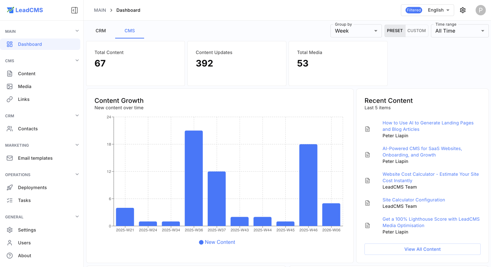
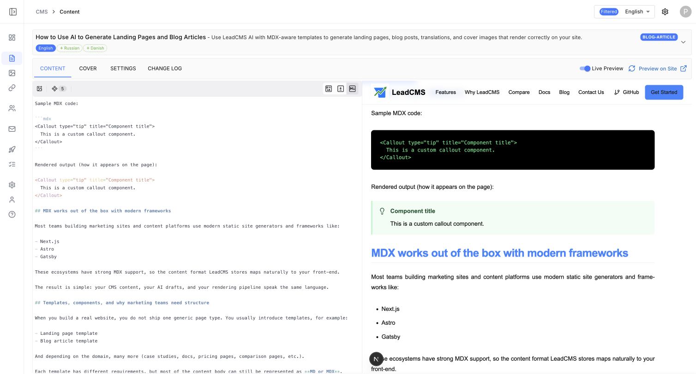
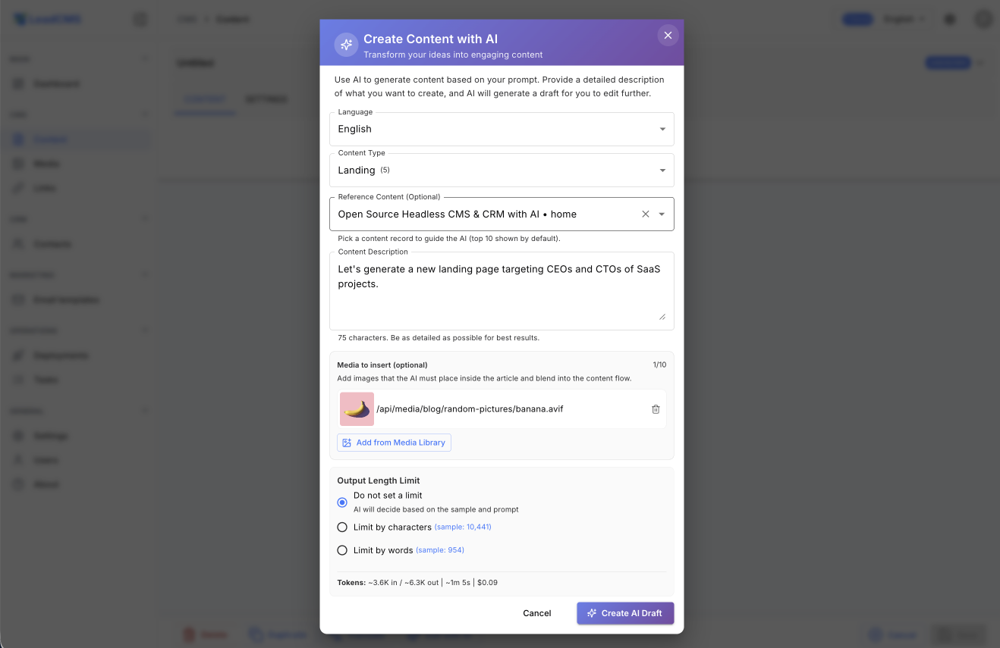
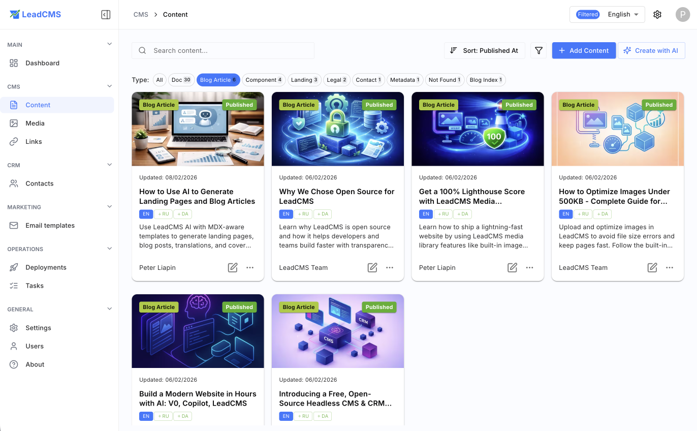
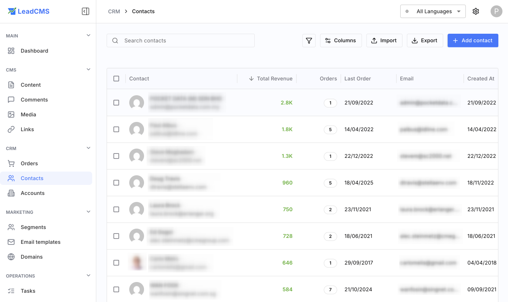
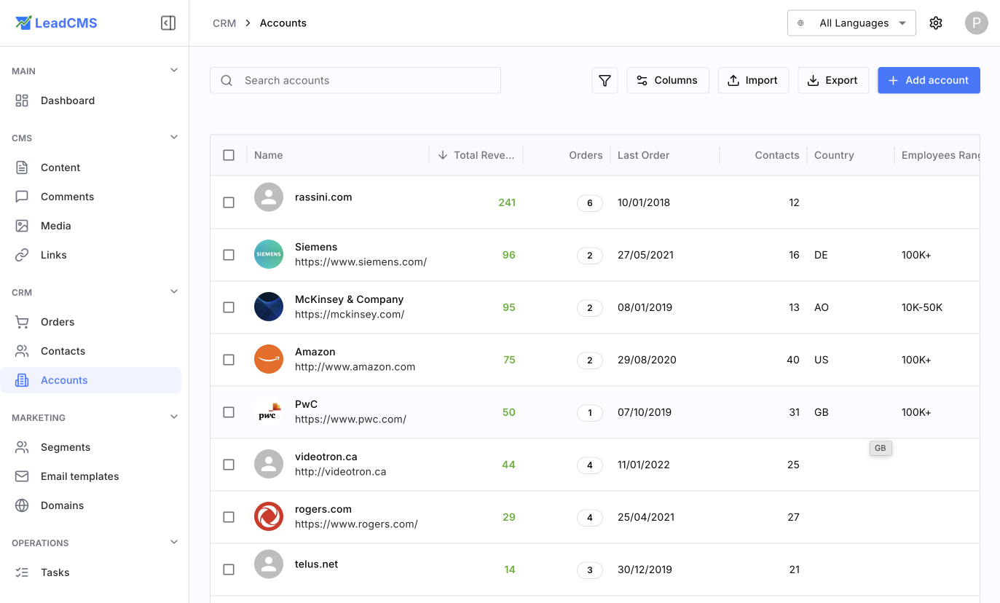
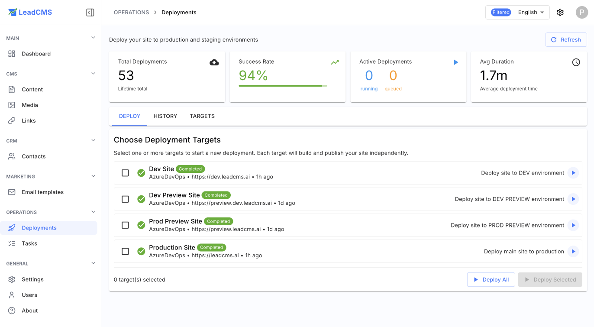
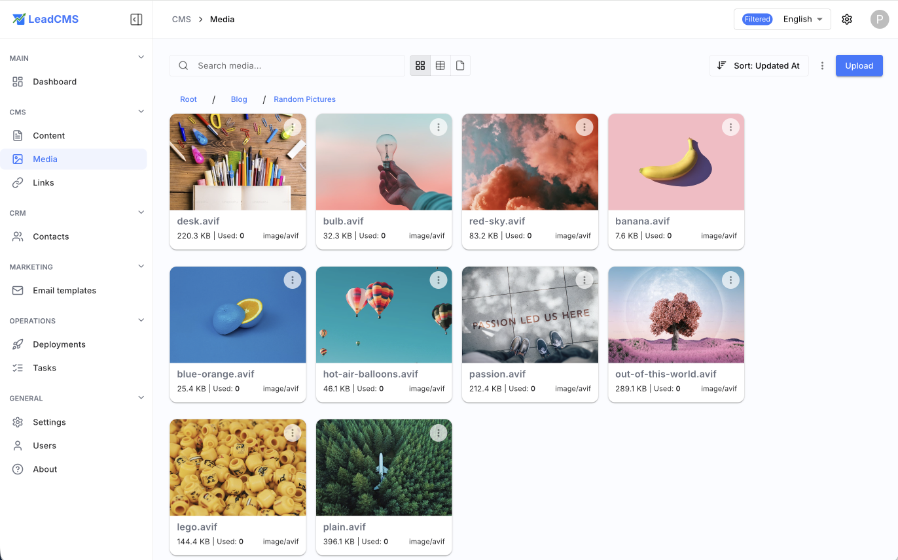

# LeadCMS Website Redesign Brief

## 1. Background

LeadCMS is an open source, AI-native, self-hostable CMS + CRM / growth stack for software and SaaS companies.

The current website is already live at:

- Main site: `https://leadcms.ai`
- Documentation: `https://leadcms.ai/docs/`
- Blog: `https://leadcms.ai/blog/`
- Lead magnet: `https://leadcms.ai/site-cost-calculator/`

The current version was designed and published before we refined the positioning through public posts, comments, private conversations, and market feedback.

The main issue with the current site is that it explains the product in words, but does not sell the product visually or strategically. It does not sufficiently show the product, the workflows, screenshots, system diagrams, or the actual value of unifying CMS, CRM, lead capture, automation, and AI workflows.

The new website should make LeadCMS feel like a serious product category contender, not an experimental open source CMS.

---

## 2. Strategic positioning

LeadCMS should not be positioned as “another CMS.”

The stronger positioning is:

**LeadCMS is an open source, AI-native growth stack for software and SaaS companies. It combines headless CMS, lead capture, CRM, marketing automation, and AI-ready workflows in one self-hostable system.**

The website should communicate that LeadCMS helps small and mid-size software/SaaS companies avoid an overstacked setup where they need one tool for CMS, another for CRM, another for email automation, another for analytics, and more tooling just to connect everything.

The central narrative:

**Small SaaS companies do not lack tools. They have too many disconnected ones.**

LeadCMS exists to unify the path from:

**content -> leads -> sales**

---

## 3. Core website message

The main message should be sharper than “open source CMS.” None of the directions below are final — this section is a strategic starting point, not a locked brief. We want the designer to challenge these ideas, propose alternatives, and bring their own thinking.

### Direction A — Category challenge

**A CMS for SaaS should be more than a CMS**
**LeadCMS turns content into customers**

_Notes: “more than a CMS” has some punch but may feel abstract. Open to stronger variants._

### Direction B — Growth platform framing

**SaaS companies do not need another CMS. They need a growth platform.**

**LeadCMS is the open source growth platform for software companies — CMS, lead capture, CRM, and AI workflows in one self-hostable system.**

_Notes: “growth platform” reframes the category entirely and distances from CMS tool comparisons. Worth exploring visually and in copy._

### Direction C — Pain-first framing

**Stop stitching together CMS, CRM, email automation, and lead capture tools**

**LeadCMS unifies the full path from content to customers — open source and self-hostable.**

### Direction D — Ownership angle

**Build your SaaS website, capture leads, automate follow-ups, and own your entire growth stack**

---

### Working subheadline (draft)

**LeadCMS is an open source, AI-native CMS + CRM that helps software companies manage content, capture leads, automate follow-ups, and own the full path from content to sales.**

### CTAs

Primary CTA:
**View on GitHub**

Secondary CTA:
**See how it works** or **Explore the demo**

---

> **Note to designer:** We are not attached to any of these directions. If you see a stronger angle based on the positioning brief, please propose it. The goal is to own a category, not to describe a feature list. We trust your instinct here.

---

## 4. Target audience

The website should primarily speak to:

### Primary audience

Small and mid-size software / SaaS companies.

Especially:

- founders
- technical founders
- CTOs
- product leaders
- growth leaders
- small SaaS marketing teams
- developer-led software businesses

### Secondary audience

Agencies and consultants building SaaS websites, growth systems, or headless CMS setups for clients.

### Contributor audience

Developers interested in open source, AI-native CMS/CRM systems, headless CMS, Next.js, .NET, PostgreSQL, and marketing automation.

---

## 5. Main pains to reflect

The site should clearly reflect the market pains we validated through LinkedIn conversations and private feedback.

Key pain points:

1. **Overstacking**
   - CMS in one place
   - CRM somewhere else
   - email automation elsewhere
   - analytics elsewhere
   - Zapier/Make/custom scripts to glue it together

2. **Poor visibility**
   - hard to see which content creates leads
   - hard to see which pages influence opportunities
   - fragmented attribution
   - no single view of the customer journey

3. **Weak ownership**
   - data lives in third-party tools
   - contact pricing grows as database grows
   - historical logs and stats may be limited
   - critical business context is spread across vendors

4. **Static/headless workflow friction**
   - headless/static sites are fast and flexible
   - but preview, publishing, localization, and marketing workflows are often awkward
   - non-technical teams become dependent on developers

5. **AI is bolted on, not native**
   - many older CMS/CRM systems were not designed for AI workflows
   - AI becomes another layer on top of an already fragmented stack
   - LeadCMS should feel AI-operable from the foundation

---

## 6. Product principles to communicate

The website should make these principles visible:

### Headless by design

LeadCMS can power modern frontends such as Next.js and other static/server-rendered sites.

### Static-friendly, but not static-only

It works well with Jamstack/static generation, but should also support dynamic workflows where needed.

### CMS + CRM together

Content, leads, contacts, opportunities, forms, campaigns, and communications should be part of one system.

### Everything as code

Not only content, but also configurable parts like templates, campaigns, sequences, segments, pipelines, automations, and settings should be representable as code/text, making the system easier for AI agents and developers to work with.

### AI-native

AI should help with:

- content generation
- landing page generation
- translation
- email templates
- campaign drafts
- automation setup
- content editing

### Open source and self-hostable

Companies should be able to own their stack, data, and workflows.

### SaaS option later

Hosted/SaaS version can be positioned as convenience, not as the only real version.

---

## 7. Website objective

The new website must do four jobs:

1. **Explain the category**
   LeadCMS is not just a CMS. It is a CMS + CRM + growth automation layer for SaaS companies.

2. **Show the product**
   The site must include real screenshots, product UI, workflow diagrams, and examples.

3. **Build trust**
   Show that this came from real internal use across XLTools, TagPoint, and client projects, not from a random idea.

4. **Convert visitors**
   Main conversions:
   - GitHub stars / repo visits
   - demo requests
   - community signups
   - newsletter / waiting list
   - open source contributor interest
   - consulting / implementation inquiries

---

## 8. Recommended site structure

### Main navigation

- Product
- Use Cases
- Docs
- Blog
- Open Source
- GitHub
- Contact / Get Demo

Optional:

- Compare
- Roadmap
- Community

---

# Proposed homepage structure

## 1. Hero section

Purpose: explain the product in 5 seconds.

Must include:

- sharp headline
- one-sentence product explanation
- primary CTA
- secondary CTA
- product screenshot or visual system diagram

Suggested copy:

**A CMS for SaaS should be more than a CMS**

LeadCMS is an open source, AI-native CMS + CRM for software companies that want to manage content, capture leads, automate follow-ups, and own the path from content to sales.

CTA:

- View on GitHub
- See product overview

Visual:

- product dashboard screenshot
- or diagram showing content -> lead capture -> CRM -> automation -> sales

---

## 2. Problem section

Purpose: create pain recognition.

Suggested headline:

**Your SaaS growth stack should not require seven disconnected tools**

Visual idea:
A messy stack diagram:

- CMS
- Forms
- CRM
- Email automation
- Analytics
- Reporting
- Zapier / Make / custom scripts

Then contrast with:
LeadCMS unified layer.

Suggested copy:
Most small SaaS teams start simple. Then the website grows, lead capture is added, CRM is connected, email automation follows, analytics gets bolted on, and soon the stack becomes harder to manage than the workflow it was meant to support.

---

## 3. Solution section

Purpose: show what LeadCMS unifies.

Suggested modules:

- Headless CMS
- Lead capture
- CRM
- Campaigns and sequences
- AI content workflows
- Localization
- Analytics / attribution direction
- Deployment / preview workflows

Each module should have a small UI card or screenshot.

---

## 4. “Built for SaaS workflows” section

Purpose: separate LeadCMS from generic CMS products.

Show flows like:

### Flow 1

Create landing page -> publish preview -> capture lead -> create contact -> start email sequence -> track opportunity

### Flow 2

Generate localized landing page with AI -> review content -> deploy -> capture leads by segment

### Flow 3

Free trial form -> CRM contact -> onboarding email -> follow-up task -> opportunity pipeline

This should be highly visual.

---

## 5. “Everything as code” section

This is a major differentiator.

Suggested headline:

**Everything configurable should be AI-ready**

Explain that content, templates, sequences, campaigns, segments, pipelines, and settings can be represented as text/code and synced with Git.

This section should include:

- code/text visual
- Git sync concept
- AI agent editing concept
- side-by-side UI + code representation

Suggested copy:
LeadCMS is designed so important business configuration does not live only behind endless clicks. Content, templates, campaigns, segments, sequences, and settings can be treated as structured text, making them easier to version, review, automate, and work with using AI tools.

---

## 6. Preview and publishing section

Important because this is a known pain in static/headless workflows.

Suggested headline:

**Preview and publish without turning every content change into a developer task**

Show:

- editor creates content
- preview updates
- approval / publish
- static site deployment
- production update

This section should speak to non-technical marketing teams and developers.

---

## 7. Open source / self-hosted section

Purpose: make the ownership argument.

Suggested headline:

**Own your growth stack**

Explain:

- self-hostable
- open source
- data ownership
- no forced lock-in
- SaaS option can exist for convenience
- external providers can still be used for delivery, for example SendGrid for sending emails, but the core history and logic stay inside LeadCMS

Suggested copy:
LeadCMS is built for teams that want control over their content, contacts, workflows, history, and commercial data. Use it as your own private growth stack, extend it, or contribute to the project.

---

## 8. Use cases section

Recommended cards:

### For SaaS founders

Launch and manage product websites, lead capture, and follow-up flows without stitching together too many tools.

### For CTOs / technical founders

Use a headless, extensible, self-hostable system that works with modern frontend stacks.

### For growth / marketing teams

Create pages, campaigns, sequences, and localized content with less developer dependency.

### For agencies

Build repeatable SaaS growth websites with CMS, lead capture, CRM, and automation already connected.

---

## 9. Product screenshots / demo section

This is critical. Current site lacks product visuals.

Designer should request or create placeholders for:

- **Content editor with live preview**

  

- **AI assistant inside editor**

  

- **Content management list**

  

- **Dashboard / content journey**

  

- **CRM contact profile**

  

- **CRM accounts**

  

- **Deployment / preview screen**

  

- **Media library**

  

- lead capture / form submissions _(screenshot needed)_
- campaign or sequence builder _(screenshot needed)_
- localization interface _(screenshot needed)_

Even if not all screens are polished, the website needs believable UI visuals.

---

## 10. Social proof / origin story section

Purpose: build credibility without overexplaining.

Suggested content:
LeadCMS was born from years of running software products like XLTools and TagPoint, where we repeatedly faced the same problem: content, leads, CRM, email automation, and analytics spread across too many systems.

This did not start as a pitch-deck product. It started as an internal operating model that kept proving useful.

---

## 11. CTA section

Suggested CTA:

**Ready to own your SaaS growth stack?**

Buttons:

- View on GitHub
- Join the early community
- Book a discussion

---

# Documentation section requirements

Docs should not feel like an afterthought. Since this is open source, documentation is part of the product.

Docs should be organized around:

- Getting started
- Installation / self-hosting
- Docker setup
- Connecting a frontend
- Next.js integration
- Content modeling
- MD / MDX content
- Forms and lead capture
- CRM basics
- Campaigns and sequences
- AI setup
- Deployment / preview
- Plugins and customization
- API reference

Docs homepage should include:

- quick start path
- developer path
- marketer/editor path
- self-hosting path

---

# Blog section requirements

The blog should support the founder narrative and category creation.

Recommended blog categories:

- SaaS growth stack
- Headless CMS
- AI-native CMS
- Open source SaaS infrastructure
- Website conversion
- Lead capture and CRM
- Static sites and preview workflows
- Product updates

Potential early posts:

- Why small SaaS companies become overstacked
- Why a CMS for SaaS should be more than a CMS
- Headless CMS vs WordPress for SaaS websites
- Why everything as code matters for AI-native workflows
- Why open source matters for your growth stack
- The hidden cost of fragmented CRM and marketing tools

---

# Lead magnet redesign

The current site-cost calculator gets some interest, but does not convert well.

Possible issues:

- too broad
- not connected strongly enough to LeadCMS pain
- users may not trust the value exchange
- email ask may come too late or feel unnecessary
- bots may be inflating activity

Better lead magnet ideas:

## Option 1: SaaS Growth Stack Audit

User answers:

- What CMS do you use?
- What CRM?
- What email automation?
- What analytics?
- What forms?
- How many tools?
- How much manual work?
- Where is lead history stored?

Output:

- stack fragmentation score
- risk areas
- suggested simplification path

This fits LeadCMS much better.

## Option 2: SaaS Website Stack Cost Calculator

Expand current calculator from website cost to total stack cost:

- CMS
- CRM
- email automation
- analytics
- forms
- integration tools
- developer time
- maintenance

Output:

- direct monthly cost
- estimated hidden integration cost
- “overstacked risk” score

## Option 3: Content-to-Customer Readiness Score

Assess how well the company connects:

- content
- leads
- CRM
- automation
- sales
- attribution

This aligns perfectly with the positioning.

My recommendation:
Replace or supplement the current calculator with:

**SaaS Growth Stack Audit**
or
**Overstacked SaaS Calculator**

CTA:
**Find out how fragmented your SaaS growth stack really is**

---

# Visual design direction

The design should feel:

- modern
- sharp
- founder/operator credible
- open source friendly
- SaaS-native
- technical but not cold
- AI-native without looking like generic AI vaporware

Avoid:

- generic abstract SaaS gradients only
- too many buzzwords
- vague AI icons
- corporate stock imagery
- pages full of text and no product visuals
- looking like a web agency landing page

Preferred visual language:

- product UI screenshots
- clean diagrams
- system maps
- modular cards
- code + UI side-by-side
- flows from content to lead to CRM to campaign to sale
- “messy stack vs unified stack” comparisons

---

# Required materials for the designer

Before the designer starts, prepare:

## Product screenshots

### Admin dashboard

### Content management

### Content editor with live preview

### AI content generation

### CRM contacts

### CRM accounts

### Deployment management

### Media library

